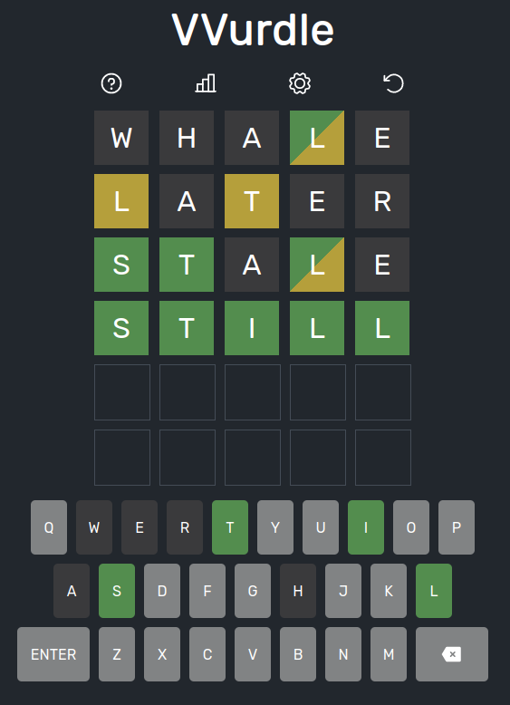

   
  
  <h1 align="center"><b>VVurdle</b></h1>
  

    
    
      
    
    
  

  

    A Wordle clone written in Vue.js.
     
    <a href="https://vvurdle.vercel.app/"><strong>vvurdle.vercel.app »</strong></a>
     
     
  

  

## More Information
More information can be found in the respective doc in the docs folder.
  - [DEVELOPMENT](./docs/DEVELOPMENT.md)
  - [DEPLOYMENT](./docs/DEPLOYMENT.md)
